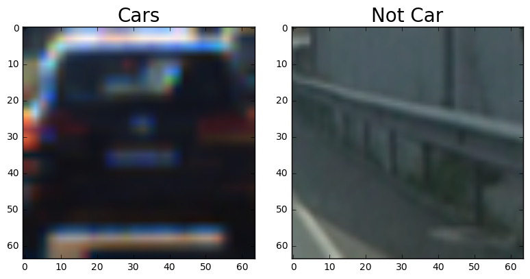
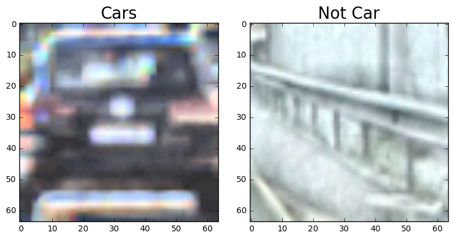
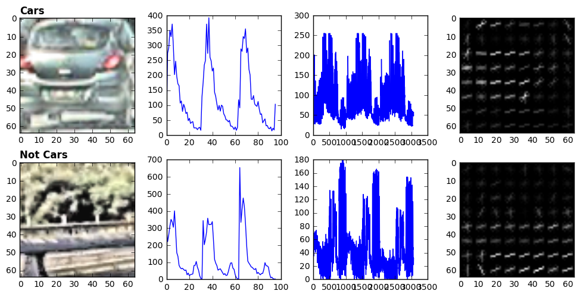

# Vehicle Detection and Tracking
--------------------------------

This repo is the Project 5 of Udacity Self-Driving Car Nanodegree. 

In the next following sections, we would walk through the pipeline how to detect and track cars from a video stream using Support Vector Machine (SVM) Classifier. This process involves few intersting Computer Vision topics such as Histogram of Gradients (HOG), Spatial binary and Color Histogram.

We divided this tutorial the into serval sections : 
1. [Extract Image Feature Vector]()
2. [Train SVM Classifier]() 
3. [Vehicle Detection]() 
4. [Vehicle Tracking]()
5. [Video Pipeline]()

## 1. Extract Image Feature Vector
The goal is to extract useful information from image so that the computer can quickly detect where is the car and where is not the car. One powerful way is to extract the Histogram of Gradients (Shape of the object), Color histogram (color of the object) and Spatial binary (overal feature of the object). Here is the example of a car and not-a-car image:


#### Trick 1: Adaptive Histogram Equalization before extracting feature.
We discovered that the training data is somewhat blurry and noisy. In this project, we combine the Feature vector of each image so it is important to have a clear image for training. In Deep Learning approach, however, it might help the model generalize better.

By applying `Adaptive Histogram Equalization` (AHE), we could achieve better image quality. **The trade-off is speed**. Thus, we only apply AHE during training.**
```
def adaptive_equalize_image(img, level):
    """
    Adaptive Histogram Equalization : http://docs.opencv.org/3.1.0/d5/daf/tutorial_py_histogram_equalization.html
    """
    clahe = cv2.createCLAHE(clipLimit=level, tileGridSize=(8, 8))
    if img.shape[2] == 3:
        lab = cv2.cvtColor(img, cv2.COLOR_RGB2LAB)
        l, a, b = cv2.split(lab)
        cl = clahe.apply(l)
        result = cv2.merge((cl, a, b))
        result = cv2.cvtColor(result, cv2.COLOR_LAB2RGB) 
    else:
        result = clahe.apply(img)
    return result
```


#### Pre-processing:
`adaptive_histogram_equalization`: **True**

#### HOG Parameters


| Parameters      | Value |
|---------------- |-------| 
| `orientation`   | 9     |
| `pix_per_cell`  | 8     | 
| `cell_per_block`| 2     | 
| `hog_channel`   | `'ALL`'|
| `transform_srt` | False |
| `feature_vector`| True  |


#### Color Histogram Parameters:

| Parameters   | Value     |
|------------- |-----------| 
| `nbins`      | 32        |
| `bin_range`  | (0.0, 1.0)| 


#### Spatial Bin Parameters:
| Parameters   | Value   |
|------------- |---------| 
| `color_space`| `YCrCb` |
| `spatial_bin`| (32, 32)| 

In following graph, we extract features from two images and display in order of : Spatial Bin, Color Histogram, Histogram of Gradient


#### Normalize Feature Vector
To avoid bias over one feature, we need to normalize the data using `StandardScaler()`
```
from sklearn.preprocessing import StandardScaler
```
**Before normalization**


**After normalization**


## 2. Train SVM Classifier
Next is to build a Support Vector Machine Classisifer to classify the image whether it is a car or not. Basically, SVM will convert the current dataset into higher dimentional space in order to make the classification process easier.


```
# svc = Pipeline([('scaling', StandardScaler()), ('classification', LinearSVC(loss='hinge')),])
svc = SupportVectorMachineClassifier()
# Apply Standard Scalars to normalize vector
svc.train(x_train, y_train)
# Test on testing set
score = svc.score(x_test, y_test)

OUTPUT:
Starting to train vehicle detection classifier.
Completed training in 4.649303 seconds.

Testing accuracy:
Accuracy 0.992399%
```


## 3. Vehicle Detection
There will be two parts:

* Using sliding technique: slow and provide a lot of False Positives
* Using subsampling HOG and adding heatmap threshold: faster and eliminate a lot of False Positives

## 4. Vehicle Tracking

We created two object in order to make the tracking task easier: `Vehicle` and `VehicleTracker`.

* `Vehicle` object holds information about the bounding box, pixels belong to an vehicle and old bounding boxes.
* `VehicleTracker` object keeps track a list of current tracked vehicles and making new adjustments based on new heatmaps from video stream

## 5. Video Pipeline
```
# Parameter
xstart = [500, 0]
xstop =  [1280, 1280]
ystart = [400, 400]
ystop =  [506,  656]
scales = [0.75,1.35]
# Vehicle Tracker
car_tracker = VehicleTracker(looking_back_frames=15)

def process_image(frame):
    global svc
    global car_tracker
    global ystar, ystop, scale
    svc_img = np.copy(frame)
    
    heatmaps = []
    # Multi-scale window
    for i, scale in enumerate(scales):
        heatmap, windows = find_cars(frame,xstart[i], xstop[i], ystart[i], ystop[i], scale, svc, dec_thresh=0.99)
        heatmaps.append(heatmap)
        
    # Combine heat map
    heatmap = np.sum(heatmaps, axis=0)
    heatmap[heatmap <= 5.] = 0
    cars, heatmap = car_tracker.update(heatmap, heat_threshold=30)
    
    # Draw car boxes
    for p1, p2 in itertools.chain(cars):
        cv2.rectangle(svc_img, p1, p2, (255, 255, 255), 4)
    # Create an heat image
    img = 255*heatmap/np.max(heatmap)
    img = np.dstack((img, heatmap, heatmap)).astype(np.uint8)
    svc_img = cv2.addWeighted(svc_img, 0.8, img, 1.0, 0.0)
    return svc_img
```
